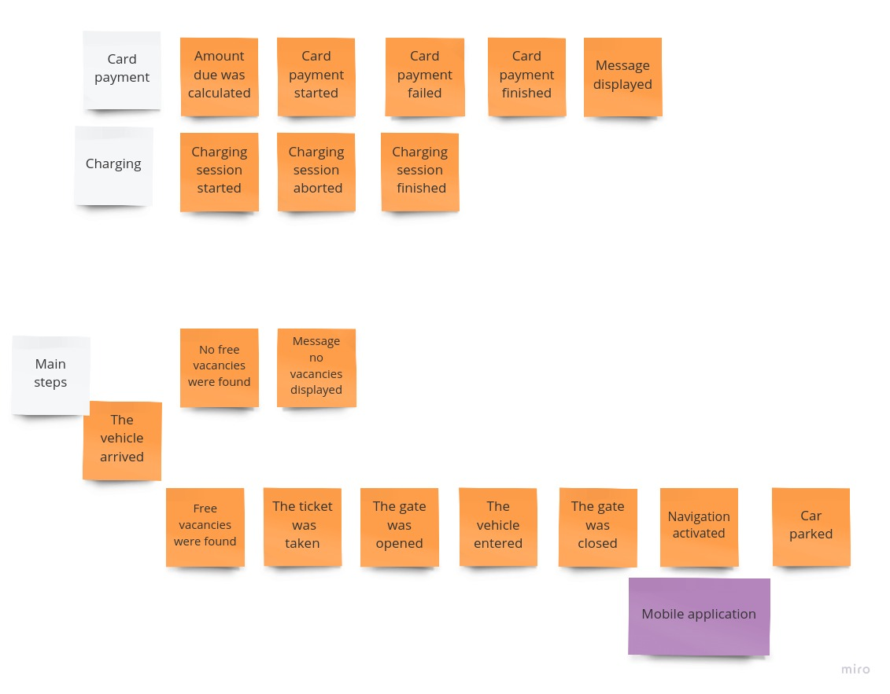

## Table of contents
- [Table of contents](#table-of-contents)
- [Intro](#intro)
- [Domain description](#domain-description)
- [Domain exploration](#domain-exploration)
  - [Big Picture Event Storming](#big-picture-event-storming)

## Intro
This is a project of system for large scale parking lot. It has been  implemented 
for educational purposes using techniques derived from the domain of DDD.

Imagine that you, and your team was asked for designing comprehensive computer system for parking lots.
This project was commissioned by the company "Stay Not Pay", which manages a network of dynamically growing car parks. 
This company has invested heavily in developing an IT system, because existing systems are not 
very competitive and should be replaced by more modern ones.

Enjoy!

## Domain description
A single parking lot consists of several levels (usually from 3 to 5). On each of them can be parked 1000 cars.
Parking log has many entry and exit gates.  The customer must get an entry ticket at each entrance gate. 
This ticket is the basis for calculating the amount due, which must be paid when customer is leaving out  by 
the exit gate. The amount due may be paid in three ways:

*   at the automated cash register (during leaving out)
*   at the customer’s info portal mounted on each parkig level (in this case, he doesn’t have to pay at the exit)
*   directly to the parking lot employee (then leaving out is free)
 
Parking payment system should handle both cash and credit card payments.

After paying, customer doesn't have to use the ticket. At the exit gate, the system  should automatically recognize that 
the invoice for this car has been paid and the gate should be opened.

The car park has various types of places intended for different types of vehicles: car, truck, van, motorcycle. 
System should control the number of cars entering the parking lot (per their type). When the last  parking space for given type vehicle is occupied, 
system should be able to show a message at the parking display board on the lowest level, and close all entrance gates for this type of vehicle.

The parking place is allocated automatically, before the vehicle enters the parking lot. 
The dimensions of the vehicle are evaluated on the basis of the camera image. 
Based on them, system should recognize the vehicle type and select the most appropriate place. 
Number of this place is displayed on the ticket.
After entering the parking lot, the vehicle guidance system is activated. It 
tracks the movement of the vehicle inside park lot and display (via mobile application) guidance signals.                                            
 
Parking lot has a spots dedicated for electric cars. It offers charging service. System should be able to register start 
and stop of charging, and calculate the amount due.

The system should support a per-hour parking fee model. 

Customers can register accounts via a website or a mobile application. One customer can set up only one account.
The registered user has a special privileges:

* can receive information about the parking lot (f.e: availability of parking slots ,special rates)
* can use a special billing plan ( daily payments, one week, one month payments )
* has opportunity to researve parking slots

Some customers may have VIP status. Application for VIP status is carried out by the system based on the client's activity.
The application must be approved via one member of the management. The VIP customer gains access to special parking lot areas. 
Each VIP customer may ask to prepare his own billing/reservations plan. This request goes to the Customer Service Department, 
where it undergoes initial verification. After positive verification, an appropriate application is being prepared and it is 
directed to Strategic Customer Service Office.  After accepting the terms, a contract is prepared. Customer receives a contract
via Mobile Application. 

The system should have an Access Control Module managed by a Security Department. 
it allows to define different permissions for authorized users.
The access control machines will be installed at selected points of the building.  
When user requests access, he will be asked to enter access code.
When the system ‘approves’ a credential, a signal can be sent automatically to open the access barrier. 
The software tracks all access and exit data, and gives full visibility 
into the movements of authorized users into and out of the parking lot.

The computer system should integrate with the business intelligence software used in the Businness Inteligence Department.
It is a third-party IT software  allowing to create advanced reports and summaries. 

## Domain exploration
### Big Picture Event Storming
#### Event Storming Symbols
 

#### First domain exploration - unordered events

